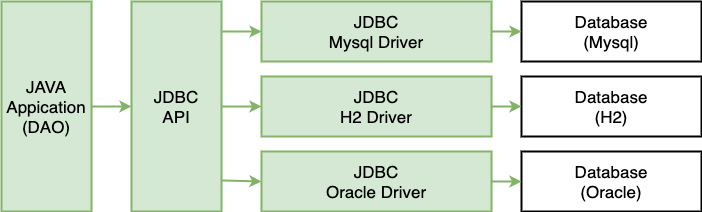

## Java Database Connectivity : 자바의 데이터 액세스 기술

## The Object-Relational Impedance Mismatch
`객체-관계형 임피던스 불일치`란, 객체 모델과 관계형 모델의 표현이 맞지 않는 다는 것을 의미한다. 
[흔히 5가지의 불일치 문제로 설명한다.](https://hibernate.org/orm/what-is-an-orm/)

### 세분성 (Granularity)
- DB 모델 : Table, Column 단 2가지의 세분화 수준. 테이블 내부 레코드에서 또 다른 테이블을 가질 수 없음. 
- 객체 : 객체 내부에 여러 객체를 둘 수 있음

### 상속/서브타입 (Inheritance/Subtypes)
- DB 모델 : 수퍼타입과 서브타입으로 공통 필드를 표현할 수 있는 약한 수준의 상속 (심지어 서브타이핑은 표준화되지 않음)
- 객체 : 공통 필드, 메서드 뿐 아니라 다형성 등 추상화 기능

### 동일성 (Identity)
- DB 모델 : 동일한 PK를 가지고 있는가?
- 객체 : `==` (identity), `equals()` (equality) 

### 연관관계 (Associations)
- DB 모델 : FK
- 객체 : 단방향 참조 (양방향 참조는 2개의 단방향 참조로 구현됨)

### 데이터 네비게이션 (Data navigation)
- DB 모델 : 쿼리를 최소화하기 위해 JOIN으로 참조 관계를 한번에 fetch
- 객체 : 참조 관계의 객체에 접근하기 위해, 순차적인 그래프 탐색 시도
