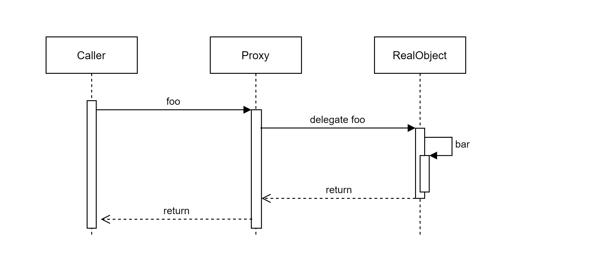

## 용어
### Aspect
여러 유형 혹은 객체를 가로지르는 (crosscutting) 문제를 모듈화한 것. 대표적으로 트랜잭션 관리가 있다. 

### Join point


### Advice
Join point가 발생했을 때 Aspect가 어떤 일을 하는가를 의미한다. `around`, `before`, `after` 유형이 있다.

### Pointcut
Join point와 일치하는 조건. 

### Introduction
### Target object
### AOP Proxy
### Weaving

## Spring AOP vs. AspectJ
### 견해 차이
### 기반 기술

### 선택 기준
Bean container가 관리하지 않는 객체에 Advice를 적용할 경우 AspectJ.


## 프록시의 동작과 self-invocation 문제
Spring AOP는 프록시 기반의 AOP를 지원한다. 다른 AOP 프레임워크와 달리, 스프링이 지향하는 방식은 프레임워크와 관련된 코드가 비즈니스 로직과 강하게 결합하지 않는 것이기 때문이다.

외부 클라이언트는 프록시인지 실제 객체인지 구분하지 않고 객체를 사용한다. 프록시는 join point를 실행하기 위해 실제 객체로 위임하며, 위임 전/후로 advice를 삽입해 부가 기능을 실행한다.
하지만 실제 객체의 self-invocation의 경우에는 advice가 적용되지 않는다. 프록시가 아닌 this reference를 참조한 메서드를 실행하기 때문이다.


다음의 예제 코드에서, 클라이언트 코드가 TxClass의 객체를 참조해 foo()를 호출했을 때, 트랜잭션 경계 설정이 올바르게 동작한다.
클라이언트 코드가 composite하는 TxClass는 실제로는 IoC 컨테이너가 후처리 과정에서 생성한 프록시이기 때문이다.
```java
@Component
public class TxClass {

    @Transactional
    public void foo() {
        bar();
    }

    public void bar() {
        // do something
    }
}
```


다음은 @Transactional 메서드의 self-invocation에서 트랜잭션 경계 설정이 되지 않는 예이다. 클라이언트 코드가 foo()를 호출해도, foo를 만족하는 pointcut이 없다.
따라서 부가 기능이 수행되지 않고, 프록시는 실제 객체에게 그대로 위임한다. 실제 객체는 this.bar()를 호출하며, 실제 객체 스스로는 advice를 가지고 있지 않으므로 트랜잭션 경계 설정에 실패한다.
```java
@Component
public class TxClass {

    public void foo() {
        bar();
    }

    @Transactional
    public void bar() {
        // do something
    }
}
```


[참조](https://docs.spring.io/spring-framework/docs/5.1.13.RELEASE/spring-framework-reference/core.html#aop-proxying)


## 스프링의 Proxy: JDK dynamic proxy vs. CGLib proxy
스프링은 인터페이스를 구현한 클래스의 프록시를 만들기 위해 JDK dynamic proxy를, 구체 클래스의 프록시를 만들기 위해 CGLib을 사용한다.

이러한 이유로 인해, auto-wiring 이슈가 발생할 수 있다.
- 어떤 AOP 기능을 포함하는 클래스가 인터페이스를 구현할 때, 이를 auto-wiring하기 위해 concrete class가 아닌 인터페이스 타입으로 선언되어야 한다. 그렇지 않으면 `UnsatisfiedDependencyException`이 발생한다.
Compositing class가 기대하는 타입은 concrete class이지만, IoC 컨테이너가 JDK 프록시를 생성하고, 프록시를 auto-wiring하려고 시도하기 때문이다.

이 설정은 `spring.aop.proxy-target-class` 속성을 통해 [강제로 바꿀 수 있다.](https://docs.spring.io/spring-framework/docs/5.1.13.RELEASE/spring-framework-reference/core.html#aop-proxying)
예를 들면, 스프링부트에서는 `spring.aop.proxy-target-class=true`를 기본값으로 설정하고 있으며, 인터페이스를 구현한 클래스에도 CGLib 프록싱을 사용한다.
[spring-boot issue](https://github.com/spring-projects/spring-boot/issues/5423#annotations:4BI2Dry9Ee2hhYeKy-EiTQ)에서는 인터페이스를 사용하지 않은 클래스에서 발생하는 프록시 이슈를 막기 위함이라고 한다.

### CGLIB proxy
런타임에 타겟 클래스를 상속하는 서브클래스 프록시를 생성한다. 생성된 프록시는 내부적으로 위임하도록 구현되어 있다. 
상속 기반이므로, final 클래스/메서드나 private 메서드를 프록싱할 수 없다. protected 메서드도 불가능하다. [참조](https://docs.spring.io/spring-framework/docs/5.1.13.RELEASE/spring-framework-reference/core.html#aop-api-proxying-class)

### JDK proxy
Reflection API를 통해 인터페이스를 구현한 클래스의 프록시를 생성한다. 
> JDK proxies are interface-based, and no interfaces means JDK proxying is not even possible.
[참조](https://docs.spring.io/spring-framework/docs/5.1.13.RELEASE/spring-framework-reference/core.html#aop-pfb-proxy-types)


