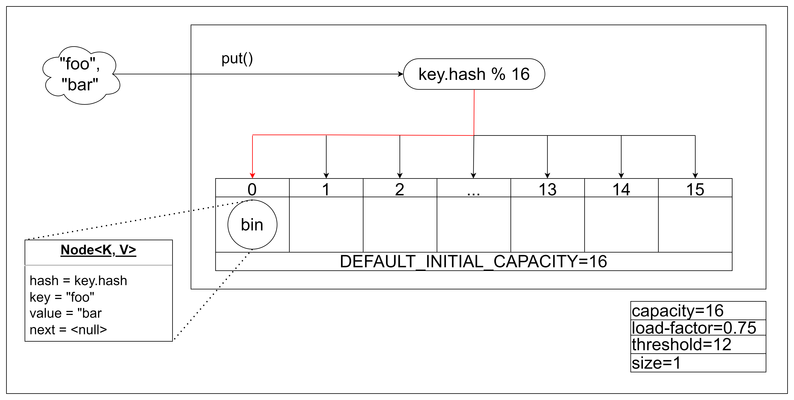

## 첫 원소 삽입과 테이블 초기화
해시맵은 내부적으로 `table` 배열을 가지고 있으며, default capacity=16으로 설정되어 있다. `capacity`는 할당된 `table` 배열의 크기를 의미하며, `size`란, 현재 해시맵에서 관리중인 노드의 수를 의미한다. 
`capacity`를 변화하게 만드는 요인인 `threshold`와 `load-factor`라는 값이 존재한다. 이들의 기본 초기값은 각각 16, 0.75로 설정되어 있다.

`table`은  `bin` 객체를 담는 배열이며, 이는 `Node` 클래스로 구현되었다. `Node`는 키, 값과 next node의 포인터를 담고 있다. 
특정 노드가 저장될 `table` 인덱스를 구하는 해시 함수는 `key의 해시코드 % table capacity`이다. `table`이 초기화되는 시점은 해시맵에 처음으로 노드가 삽입되는 시점까지 미뤄진다.

그림은 키로 "foo", 값으로 "bar"를 갖는 원소를 해시맵에 저장하는 과정을 보여준다. 이 원소의 해시 결과를 0으로 가정, 키 값을 담는 `bin`이 생성되어 table[0]에 저장되었다. 
이로써, size=1을 갖게 된다.

> NOTE: `capacity`는 2^n임이 보장되어야 한다. bitwise로 modulo를 표현한 함수가 예상치 못하게 동작할 수 있다.

## 원소의 조회
Map에 여러 키-값이 추가되었다. `table[1]`에는 두 bin이 단방향 연결리스트 형태로 저장되고 있다. 두 키가 해시 충돌되어 같은 인덱스에 저장된 상황을 의미한다. 
충돌된 두 노드를 "Siblings", "Teheran"으로 가정하자. "Siblings"라는 키에 매핑된 값을 찾는 과정은 다음과 같다.
1. "Siblings"의 해시코드를 해싱해 인덱스를 결정한다.
2. 해당 인덱스에 담긴 노드의 키와 주어진 입력 키의 해시코드와 equality을 비교한다. 리스트 형태로 체이닝될 수 있으므로, next node를 순회하며 이 과정을 반복한다.
3. 일치하는 키를 찾으면 리턴한다.

table의 capacity는 기본값인 16이며, 현재까지 추가된 bin의 수 (size)는 12이다. 

## table resize

해시 테이블 자료구조를 설명할 때 '비둘기 집 원리'를 예시로 설명하는 경우가 많다. 
크기가 16인 비둘기집(capacity)에 16개의 비둘기(size)를 담기 위한 이상적인 배치는 각 집에 하나의 비둘기가 골고루 들어간 상황이다.
하지만 어떤 집에는 비둘기가 없는 대신 다른 집에 두 비둘기가 들어갈 수 있는데, 이를 해시 충돌로 비유한 것이다. 
만약 비둘기가 한마리 더 추가된다면 한 집에 둘 이상의 비둘기가 들어가는 상황, 즉 해시 충돌이 필연적으로 발생한다.

해시맵에서 충돌이 발생하는 근본적인 이유는, int 범위로 표현되는 해시코드를 `capacity`라는 제한된 크기로 매핑하기 때문이다. 
이를 반대로 생각하면, `capacity`가 커질수록 해시 충돌이 완화될 수 있다. 이 `capacity`를 동적으로 늘리기 위한 기준이 `threshold`와 `load factor` 이다. 

`threshold`와 `load factor`는 각각 초기 기본값으로 12, 0.75를 가진다. 해시맵의 `size`가 `threshold`를 넘어서면 2배 큰 `table`을 새로 만들게 된다.
이때 `threshold = load factor * capacity`로 설정된다. `load factor`는 해시맵의 성능을 결정할 수 있는 요소로써, 사용자가 생성자에서 설정할 수 있다. `load factor`가 작을수록 더 이른 타이밍에 큰 공간을 만들어낼 수 있다. 
이는 균일한 해시 분포를 유지해 조회 성능의 시간적 이점을 얻기 위해 더 큰 공간 비용을 지불하는 것이다.

그림은 새 원소가 추가되어 size가 13으로 증가한 상황이다. `size > threshold`이므로, 해시맵은 기존 테이블보다 2배 큰 새 table 배열을 만든다. 그 결과, `threshold` 또한 2배로 증가한다.  
기존 테이블을 순회하면서, 각각의 bin을 새 capacity로 리해싱한다. 아래 그림에서, `New Table[16]`에는 `Old Table[0]`에서 충돌로 인해 리스트로 연결된 bin이 새로운 공간으로 저장된 상황을 보여준다.
즉, resize 과정에서 리스트 체이닝되었던 원소들이 분산될 수 있다. 

## 원소의 리스트 체이닝과 Treeify
해시 충돌이 심하게 발생해 한 버킷에 여러개의 bin이 연결리스트로 저장되는 상황을 가정하자. `HashMap`에는 `TREEIFY_THRESHOLD`라는 값으로, 연결 리스트로 관리될 수 있는 bin의 최대 길이를 제한한다.
만약, 체이닝된 bin의 개수가 이 값을 넘어서면, 리스트를 Red-black tree 구조로 변환하는 'Treeify' 작업을 하게 된다.

Treeify를 위한 조건은 두가지를 모두 만족하는 경우이다.
- `체이닝된 bin의 개수 > TREEIFY_THRESHOLD`
- `현재 capacity > MIN_TREEIFY_CAPACITY`
두번째 조건은 capacity가 충분히 작은 경우, treeify 하기 보다는 resize로 리스트 체인을 분산시킬 수 있기 때문이다. `MIN_TREEIFY_CAPACITY=64`로 설정된다. 해시 충돌이 자주 일어나는 상황에서, 더 큰 해시 공간을 만드는 것이 충돌을 피하는 데 유리할 수 있다.
즉, 아래 그림에서는 resize가 일어나게 된다.

다음 그림처럼 capacity가 64인 경우에는 treeify가 실행된다.

Treeify는 Node 타입의 bin 객체를 TreeNode로 변환한다. 이후, 단방향 연결 구조를 red-black-tree 형태로 재구성한다. 

