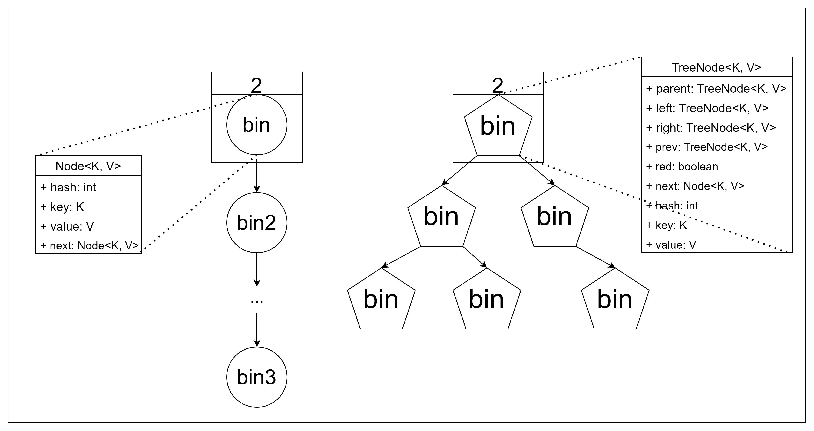

### 첫 원소 삽입과 해시맵 초기화
해시맵은 내부적으로 `table` 배열을 가지고 있으며, default capacity=16으로 설정되어 있다. `table`은  `bin` 객체를 담는 배열이며, 이는 `Node` 클래스로 구현되었다. `Node`는 키, 값과 next node의 포인터를 담고 있다. 
특정 노드가 저장될 `table` 인덱스를 구하는 해시 함수는 `key의 해시코드 % table capacity`이다. `table`이 초기화되는 시점은 해시맵에 처음으로 노드가 삽입되는 시점까지 미뤄진다.

키로 "foo", 값으로 "bar"를 갖는 원소를 해시맵에 저장하는 과정을 보여준다. 이 원소의 해시 결과는 0이므로, 키 값을 담는 `bin`이 생성되고 table[0]에 저장되었다.
> NOTE: `capacity`는 2^n임이 보장되어야 한다. bitwise로 modulo를 표현한 함수가 예상치 못하게 동작할 수 있다.

### 원소의 저장과 resize
Map에 여러 키-값이 추가되었다. table[1]에는 두 bin이 단방향 연결리스트 형태로 저장되고 있다. 두 키가 해시 충돌되어 같은 인덱스에 저장된 상황을 의미한다. 
아직까지 table의 capacity는 기본값인 16이며, 현재까지 추가된 bin의 수 (size)는 12이다. `threshold`와 `load-factor`는 각각 초기 기본값인 12, 0.75를 가정한다.
`threshold`는 capacity를 더블링할 threshold size를 의미한다. `threshold = load-factor * capacity`의 관계를 갖는다.

새 원소가 추가되어 size가 13으로 증가한 상황이다. `size > threshold`이므로, 해시맵은 기존 테이블보다 2배 큰 새 table 배열을 만든다. 그 결과, `threshold` 또한 2배로 증가한다.  
기존 테이블을 순회하면서, 각각의 bin을 새 capacity로 해싱한다. 아래 그림에서, `New Table[17]`에는 기존 테이블에서 충돌로 인해 리스트로 연결된 bin이 새로운 공간으로 저장된 상황을 보여준다.
resize를 통해 리스트 체이닝되었던 원소들이 분산될 수 있다. 

### 원소의 리스트 체이닝과 Treeify
해시 충돌이 심하게 발생해 한 버킷에 여러개의 bin이 연결리스트로 저장되는 상황을 가정하자. `HashMap`에는 `TREEIFY_THRESHOLD`라는 값으로, 연결 리스트로 관리될 수 있는 bin의 최대 길이를 제한한다.
만약, 체이닝된 bin의 개수가 이 값을 넘어서면, 리스트를 Red-black tree 구조로 변환하는 'Treeify' 작업을 하게 된다.

Treeify를 위한 조건은 두가지를 모두 만족하는 경우이다.
- `체이닝된 bin의 개수 > TREEIFY_THRESHOLD`
- `현재 capacity > MIN_TREEIFY_CAPACITY`
두번째 조건은 capacity가 충분히 작은 경우, treeify 하기 보다는 resize로 리스트 체인을 분산시킬 수 있기 때문이다. `MIN_TREEIFY_CAPACITY=64`로 설정된다. 해시 충돌이 자주 일어나는 상황에서, 더 큰 해시 공간을 만드는 것이 충돌을 피하는 데 유리할 수 있다.
즉, 아래 그림에서는 resize가 일어나게 된다.

다음 그림처럼 capacity가 64인 경우에는 treeify가 실행된다.

Treeify는 Node 타입의 bin 객체를 TreeNode로 변환한다. 이후, 단방향 연결 구조를 red-black-tree 형태로 재구성한다. 

