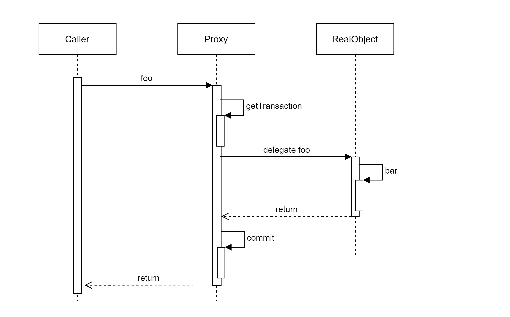
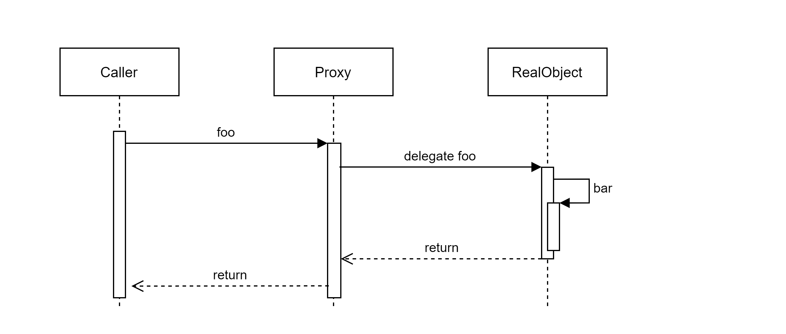

## 프록시의 동작과 self-invocation 문제
Spring AOP는 프록시 기반의 AOP를 지원한다. 다른 AOP 프레임워크와 달리, 스프링이 지향하는 방식은 프레임워크와 관련된 코드가 비즈니스 로직과 강하게 결합하지 않는 것이기 때문이다.
AspectJ와 같이 강력한 AOP 기능을 지원하는 프레임워크는 별도의 컴파일러를 사용하는 등, 코드가 특정 기술에 강하게 결합할 우려가 있다.

스프링의 프록시 기반 AOP 원리는 클라이언트로 받은 요청을 프록시가 받은 후, 실제 객체로 위임하기 전/후로 advice를 삽입해 부가 기능을 실행하는 것이다.
이러한 원리로 인해, 실제 객체 내부에서의 [self-invocation](https://docs.spring.io/spring-framework/docs/5.1.13.RELEASE/spring-framework-reference/core.html#aop-proxying) 의 경우에는 advice가 적용되지 않는다. 프록시가 아닌 `this` reference를 참조한 메서드를 실행하기 때문이다.

다음의 예제 코드는 Aspect와 Target을 정의한다. Target의 foo를 point cut으로 설정했다.
```java
@Component
public class CustomTarget {

    public void foo() {
        System.out.println("hello from foo");
        bar();
    }

    public void bar() {
        System.out.println("hello from bar");
    }
}
```
```java
@Aspect
@Component
public class CustomAspect {

    @Before("execution(* me.shoukou.sample.aop.aspect.CustomTarget.foo())")
    public void beforeAdvice() {
        System.out.println("beforeAdvice executed");
    }

    @Around("execution(* me.shoukou.sample.aop.aspect.CustomTarget.foo())")
    public void aroundAdvice(ProceedingJoinPoint pjp) throws Throwable {
        System.out.println("aroundAdvice - before invoke join point");
        pjp.proceed();
        System.out.println("aroundAdvice - after invoke join point");
    }

    @After("execution(* me.shoukou.sample.aop.aspect.CustomTarget.foo())")
    public void afterAdvice() {
        System.out.println("afterAdvice executed");
    }
}
```

이 예에서 CustomTarget을 composite 하는 클라이언트 코드가 `foo()`를 호출하면 세개의 advice가 모두 적용되며, 아래와 같은 메시지가 출력된다.
```
aroundAdvice - before invoke join point
beforeAdvice executed
hello from foo
hello from bar
afterAdvice executed
aroundAdvice - after invoke join point
```

이번에는 `CustomAspect`에서 point cut을 foo()에서 bar()로 수정한다.
```java
@Aspect
@Component
public class CustomAspect {

    @Before("execution(* me.shoukou.sample.aop.aspect.CustomTarget.bar())")
    public void beforeAdvice() {
        System.out.println("beforeAdvice executed");
    }

    @Around("execution(* me.shoukou.sample.aop.aspect.CustomTarget.bar())")
    public void aroundAdvice(ProceedingJoinPoint pjp) throws Throwable {
        System.out.println("aroundAdvice - before invoke join point");
        pjp.proceed();
        System.out.println("aroundAdvice - after invoke join point");
    }

    @After("execution(* me.shoukou.sample.aop.aspect.CustomTarget.bar())")
    public void afterAdvice() {
        System.out.println("afterAdvice executed");
    }
}
```

이 경우 어떤 advice도 적용되지 않는 것을 출력 결과로 알 수 있다.
```
hello from foo
hello from bar
```

이는 실제 객체의 self-invocation 문제로 나타나는 현상이다. 
`@Transactional`을 통해 선언적 트랜잭션이 설정된 메서드는 프록시가 아닌 실제 객체로부터 호출된다면 의도한 트랜잭션 경계가 설정되지 않는다.

예제 코드의 around advice 중 조인 포인트 전후에서 호출되는 두 개의 print 문을 각각 `getTransaction()`과 `commit()`이라고 가정하자.
클라이언트는 프록시를 통해 `foo()`를 호출할 것이다.

포인트컷이 `foo()`로 설정된 경우,  `foo()`는 포인트컷 조건과 일치하기 때문에, 프록시는 조인 포인트 전후로 트랜잭션 경계를 설정하는 advice를 실행한다. 


반면, 포인트컷이 `bar()`로 설정된 경우, `foo()`는 포인트컷 조건에 일치하지 않는다. 프록시는 그대로 실제 객체에게 `foo()` 실행을 위임한다.
이후, 실제 객체는 `this.bar()`를 호출한다. 실제 객체는 트랜잭션 경계 설정과 관련된 코드가 없기 때문에, 의도한 트랜잭션 경계 설정에 실패하게 된다.


## 스프링의 Proxy: JDK dynamic proxy vs. CGLib proxy
스프링은 인터페이스를 구현한 클래스의 프록시를 만들기 위해 JDK dynamic proxy를, 구체 클래스의 프록시를 만들기 위해 CGLib을 사용한다.

이러한 이유로 인해, auto-wiring 이슈가 발생할 수 있다.
- 어떤 AOP 기능을 포함하는 클래스가 인터페이스를 구현할 때, 이를 auto-wiring하기 위해 concrete class가 아닌 인터페이스 타입으로 선언되어야 한다. 그렇지 않으면 `UnsatisfiedDependencyException`이 발생한다.
Compositing class가 기대하는 타입은 concrete class이지만, IoC 컨테이너가 JDK 프록시를 생성하고, 프록시를 auto-wiring하려고 시도하기 때문이다.

이 설정은 `spring.aop.proxy-target-class` 속성을 통해 [강제로 바꿀 수 있다.](https://docs.spring.io/spring-framework/docs/5.1.13.RELEASE/spring-framework-reference/core.html#aop-proxying)
예를 들면, 스프링부트에서는 `spring.aop.proxy-target-class=true`를 기본값으로 설정하고 있으며, 인터페이스를 구현한 클래스에도 CGLib 프록싱을 사용한다.
[spring-boot issue](https://github.com/spring-projects/spring-boot/issues/5423#annotations:4BI2Dry9Ee2hhYeKy-EiTQ)에서는 인터페이스를 사용하지 않은 클래스에서 발생하는 프록시 이슈를 막기 위함이라고 한다.

### CGLIB proxy
런타임에 타겟 클래스를 상속하는 서브클래스 프록시를 생성한다. 생성된 프록시는 내부적으로 위임하도록 구현되어 있다. 
상속 기반이므로, final 클래스/메서드나 private 메서드를 프록싱할 수 없다. protected 메서드도 불가능하다.
[참조](https://docs.spring.io/spring-framework/docs/5.1.13.RELEASE/spring-framework-reference/core.html#aop-api-proxying-class)

### JDK proxy
[Reflection API](https://docs.oracle.com/en/java/javase/11/docs/api/java.base/java/lang/reflect/Proxy.html#newProxyInstance) 를 통해 인터페이스를 구현한 클래스의 프록시를 생성한다.
`JdkDynamicAopProxy`는 `Proxy#newProxyInstance`를 호출하는 것을 볼 수 있다.

```java
    @Override
	public Object getProxy(@Nullable ClassLoader classLoader) {
		if (logger.isTraceEnabled()) {
			logger.trace("Creating JDK dynamic proxy: " + this.advised.getTargetSource());
		}
		return Proxy.newProxyInstance(classLoader, this.proxiedInterfaces, this);
	}
```
> JDK proxies are interface-based, and no interfaces means JDK proxying is not even possible.
[참조](https://docs.spring.io/spring-framework/docs/5.1.13.RELEASE/spring-framework-reference/core.html#aop-pfb-proxy-types)

## Spring AOP: 프록시가 생성되는 과정 (spring boot startup)
### TL;DR
Spring은 싱글턴 bean을 생성하기 위해 `BeanFactory#getBean`을 호출한다. 이 과정에서, 해당 빈을 처리할 수 있는 `BeanPostProcessor`가 있는지 확인하고 적용한다.
이 `BeanPostProcessor` 중 `AbstractAutoProxyCreator`는 target bean에 적절한 `ProxyFactory`를 생성한 후, 런타임 auto-proxy 생성을 요청해 받아온다.

###  스프링 프록시 생성 과정
다음은 스프링 부트의 startup 과정에서, `AbstractAutowireCapableBeanFactory`가 생성된 빈을 post-process 하는 코드 스니핏이다.
```java
@Override
public Object applyBeanPostProcessorsAfterInitialization(Object existingBean, String beanName)
        throws BeansException {

    Object result = existingBean;
    for (BeanPostProcessor processor : getBeanPostProcessors()) {
        Object current = processor.postProcessAfterInitialization(result, beanName);
        if (current == null) {
            return result;
        }
        result = current;
    }
    return result;
}
```

`AbstractAutoProxyCreator`는 `getAdvicesAndAdvisorsForBean`로 해당 bean에 적용할 advisor bean을 찾는다.
내부적으로 `AbstractAdvisorAutoProxyCreator#findAdvisorsThatCanApply`를 호출하며, 등록된 advisor 중 이 bean에 적용할 수 있는지 검사한다.
예를 들면, 등록할 빈의 join point가 point cut 표현식과 일치하는지 등의 검사를 하게 된다. (`AopUtils#canApply`) 이후, `ProxyFactory`를 생성하고 새 Proxy로 감싸 리턴한다.
```java
@Override
public Object postProcessAfterInitialization(@Nullable Object bean, String beanName) {
    if (bean != null) {
        Object cacheKey = getCacheKey(bean.getClass(), beanName);
        if (this.earlyProxyReferences.remove(cacheKey) != bean) {
            return wrapIfNecessary(bean, beanName, cacheKey);
        }
    }
    return bean;
}

protected Object wrapIfNecessary(Object bean, String beanName, Object cacheKey) {
    ...
    
    // Create proxy if we have advice.
    Object[] specificInterceptors = getAdvicesAndAdvisorsForBean(bean.getClass(), beanName, null);
    if (specificInterceptors != DO_NOT_PROXY) {
        this.advisedBeans.put(cacheKey, Boolean.TRUE);
        Object proxy = createProxy(
                bean.getClass(), beanName, specificInterceptors, new SingletonTargetSource(bean));
        this.proxyTypes.put(cacheKey, proxy.getClass());
        return proxy;
    }

    this.advisedBeans.put(cacheKey, Boolean.FALSE);
    return bean;
}
```

`DefaultAopProxyFactory`가 프록시를 생성하는 과정이다. `spring.aop.proxy-target-class`의 여부, 타겟 클래스의 인터페이스 상속 여부 등을 판단해
JDK 프록시를 만들지 CGLIB 프록시를 만들지 결정한다.
```java
@Override
public AopProxy createAopProxy(AdvisedSupport config) throws AopConfigException {
    if (!NativeDetector.inNativeImage() &&
            (config.isOptimize() || config.isProxyTargetClass() || hasNoUserSuppliedProxyInterfaces(config))) {
        Class<?> targetClass = config.getTargetClass();
        if (targetClass == null) {
            throw new AopConfigException("TargetSource cannot determine target class: " +
                    "Either an interface or a target is required for proxy creation.");
        }
        if (targetClass.isInterface() || Proxy.isProxyClass(targetClass) || ClassUtils.isLambdaClass(targetClass)) {
            return new JdkDynamicAopProxy(config);
        }
        return new ObjenesisCglibAopProxy(config);
    }
    else {
        return new JdkDynamicAopProxy(config);
    }
}
```
