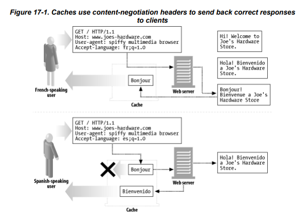
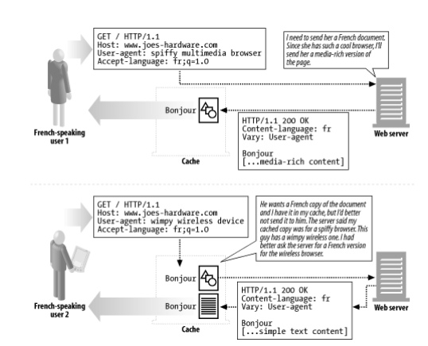

## 컨텐츠 협상
하나의 URL이 여러 리소스에 대응할 때, 사용자에게 가장 적합한 리소스 버전을 결정하기 위한 협상.
여러 버전을 `variant`라 하며, 다음의 것들이 variant가 될 수 있다.
- 사용자에게 맞는 언어
- 사용자가 디코딩할 수 있는 캐릭터 인코딩 셋(charset)
- 사용자의 브라우저가 지원하지 않는 컨텐츠 대신 지원 가능한 컨텐츠

컨텐츠 협상은 variant의 탐색, 적절한 리소스에 대한 추측에 대한 비용으로 성능 문제가 있을 수도 있다.

## 클라이언트 주도 협상의 예
서버는 제공 가능한 모든 리소스 버전의 링크 목록을 클라이언트에게 응답하고, 클라이언트는 이 중 하나를 선택하도록 한다.
이 방법은 클라이언트는 2번의 요청을 해야 하기 때문에 대기시간이 증가한다.

1. 클라이언트는 서버로 리소스 요청을 보낸다.
2. 서버는 제공할 수 있는 여러 언어 선택지 목록을 응답한다.
3. 클라이언트는 이 중 원하는 버전을 선택하고 요청한다.

## 서버 주도 협상
클라이언트의 헤더에 원하는 리소스 버전을 담아 요청한다. 서버는 이 중 자신이 가지고 있는 리소스를 응답한다.
클라이언트 주도 협상에 비해 협상 과정이 짧기 때문에 응답 시간이 빠르다. 하지만 서버가 제공할 수 있는 리소스가 없는 경우 서버는 적절한 버전을 추측해 응답해야 한다.
또한, 협상의 대상이 되는 기능에 따라 별도의 헤더가 추가되어야 한다는 문제점이 있다.

1. 클라이언트는 Accept 헤더에 자신이 선호하는 버전을 명시한다. 원하는 선택지가 여러개라면, `q값`으로 그 우선순위를 지정할 수 있다.
    - 영어, 한국어, 일본어, 프랑스어의 우선순위로 선택하는 Accept-Language 헤더 : `Accept-Language:en;q=0.9, ko;q=0.8, fr;q=0.6,ja;q=1.0`
2. 서버는 이 우선순위에 따라 제공 가능한 리소스를 돌려준다.

서버는 `Vary` 라는 헤더를 응답한다. 요청 헤더 중 서버가 리소스를 선택한 기준이 되는 헤더들을 나열한 목록이다.
이 헤더는 아래의 투명 협상과 같이 서버와 클라이언트의 협상 과정 사이에 캐시가 끼어드는 경우를 고려한다.

## 투명 협상
협상 과정을 서버와 클라이언트 사이의 캐시가 대신함으로써 서버의 부하를 줄일 수 있다.

캐시는 서버로부터 받은 응답을 저장한다. 이때, 서로 다른 Accept 헤더를 가진 요청에 대해 같은 리소스를 전달해선 안된다.
따라서, 캐시는 요청에 대해 Accept 헤더를 비교하고, 서버로부터 각각의 리소스를 받아 저장해야 한다.

서버는 응답으로 `Vary` 헤더를 담아주고 있다. 아래 그림은 서버가 리소스를 선택한 기준이 `User-Agent`인 예이다.
서로 같은 Accept 요청 헤더를 받았지만, `User-Agent`에 의해 다른 variant를 돌려줘야 하는 상황이 있다.
캐시는 요청 헤더의 `User-Agent`를 함께 저장하고, 이후의 요청에 대해서 같은 `User-Agent`를 가지는지 비교해야 한다.

