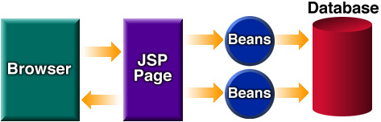
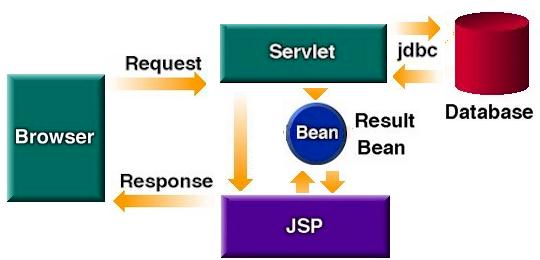
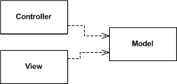
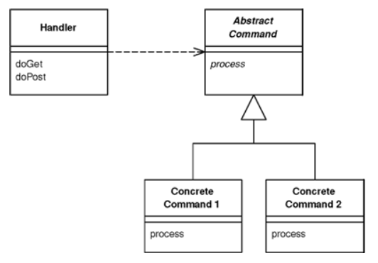

JSP Access Model은 [JSP Specification v0.92](http://www.kirkdorffer.com/jspspecs/jsp092.html#model) 에서 사용된 용어로, JSP로 요청을 처리하기 위한 두 가지 모델을 지칭한다.

## Servlet: 모델과 뷰의 결합
다음은 도메인 모델과 DB를 이용해 비즈니스 로직을 처리하고, HTML 문서를 응답하는 서블릿의 구현의 예제이다. 
```java
@WebServlet(name="memberSaveServlet", urlPatterns = "/servlet/members/save")
public class MemberSaveServlet extends HttpServlet {
    
	private MemberRepository memberRepository = MemberRepository.getInstance();
	
	@Override
	public void doGet(HttpServletRequest req, HttpServletResponse res) throws ServletException, IOException {
		String username = req.getParameter("username");
		int age = Integer.parseInt(req.getParameter("age"));
        
        // business logic
		Member member = new Member(username, age);
        member.doBusinessLogic();
		memberRepository.save(member);
		
        // presentation
		res.setContentType("text/html");
		res.setCharacterEncoding("utf-8");
		PrintWriter w = res.getWriter();
		w.write("<html>\n" +
				 "<head>\n" +
				 " <meta charset=\"UTF-8\">\n" +
				 "</head>\n" + ... );
	}
}
```
단순히 사용자에게 보여지는 부분만 변경하고 싶음에도 서블릿의 recompile, 서버의 redeploy가 필요해진다. 비즈니스 로직과 Presentation이 분리되어 있지 않아 발생하는 문제이다.

## JSP Access Model 1
클라이언트는 직접 JSP 페이지를 요청한다. JSP 페이지는 비즈니스 로직을 처리하는 JavaBeans에게 정보를 요청한다. JSP는 결과에 대한 View를 클라이언트에게 응답한다. 
비즈니스 로직과 프레젠테이션의 관심사 분리가 이루어졌다. 각 페이지는 JavaBeans를 통해 비즈니스 로직을 재사용할 수 있다.



하지만 Navigation control이 여러 JSP에 분산되어 있다는 문제가 있다. 각 JSP 페이지는 다음 페이지를 결정하기 위한 로직을 가지고 있다. JSP 페이지가 다른 페이지를 참조하는 경우가 있으며, 이때 페이지의 이름이 변경된다면, 이 페이지를 참조하는 다른 JSP 페이지가 수정되어야 한다. 
프로젝트의 규모가 커질수록 유지하기 어려워진다.

## JSP Access Model 2
클라이언트의 요청을 Servlet이 받은 후, 요청을 처리하기에 적절한 JavaBeans를 선택하고 결과를 요청한다. 응답할 JSP 페이지를 결정하고 응답한다. 
Nevigation control은 Servlet이, 비즈니스 로직은 JavaBeans이, Presentation은 JSP 페이지가 담당하도록 역할이 분리되었다. 이는 MVC 패러다임과 연관된다.



## Motion-View-Controller 
[MVC 패턴](https://martinfowler.com/eaaDev/uiArchs.html#ModelViewController) 은 세 가지 컴포넌트로 이루어져있다. 1) Model은 도메인 모델로서, 비즈니스와 관련된 사물을 객체로 모델링한 것이다. 2) View는 모델을 UI로 표현한다. 3) Controller는 클라이언트의 입력을 받아 모델을 조작하고, 뷰를 적절히 업데이트한다.



MVC의 중요한 특징은 [Model을 Presentation과 분리한다는 점이다.](https://martinfowler.com/eaaDev/SeparatedPresentation.html) Presentation은 View를 만들기 위한 데이터로 이해할 수 있다. 
Presentation은 Model에 의존하지만, Model은 Presentation과 의존하지 않도록 엄격하게 분리한다. Model은 다양한 Presentation을 개발할 때 재사용되어야 하며, 이를 위해서는 Model은 Presentation과 무관하게 구현되어야 한다.
또한 Model은 nonvisual 요소이며, 이로 인해 테스트가 보다 쉽다는 장점이 있으나, Presentation과 결합되면 테스트가 어려워질 수 있다[P of EAA]. 

앞서 살펴 본 Model 2의 경우, 서블릿이 Controller, JavaBeans이 Model, JSP 페이지가 View를 담당하는 것으로 볼 수 있다.

## Front Controller
인증, locale, internalization 등 공통된 작업의 구현이 각각의 컨트롤러에 분산된 경우 중복이 발생한다. Front Controller는 이러한 작업을 공통화하기 쉽도록 한다.
Front Controller는 Handler와 Command로 구성된다. 단 하나의 Handler가 모든 요청을 받은 후, 적절한 Concrete Command를 실행하는 패턴이다. Handler는 URL과 메서드 정보를 파악해 적절한 Command를 결정하고 실행한다. Command는 요청을 처리하고 응답을 선택해 되돌려준다.



Handler는 단 하나이기 때문에, 핸들러를 래핑하는 데코레이터를 만들 수 있다. 데코레이터는 인증과 같은 공통된 작업을 처리하는 Filter chain 역할을 할 수 있도록 한다.
또한, 프론트 컨트롤러 패턴에서는 설정 파일을 이용하면 Handler를 수정하지 않고도 handling할 URL을 추가할 수 있다. URL을 처리할 Command를 설정 파일에 구성한 후, web.xml에 핸들러 서블릿의 init() 인자로 넘겨준다. 초기화 과정에서 이 정보를 Map에 저장함으로써, 적절한 Command를 look-up 할 수 있게 된다.   


