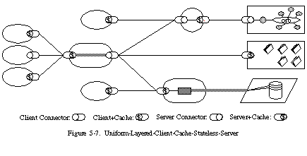

# Constraints of RESTful architecture 
## Client-Server
클라이언트-서버 구조를 가진다. 클라이언트는 서버로 요청을 보냄으로써 서비스를 트리거링하며, 대기 상태에 있던 서버는 트리거링에 반응해 서비스를 제공한다.
클라이언트-서버 구조는 인터페이스를 통해 통신한다. 인터페이스를 준수하는 한, 클라이언트와 서버는 독립적으로 발전할 수 있다는 장점이 있다.

## Uniform Interface
클라이언트와 서버 간 인터페이스는 일관성이 있어야 한다는 조건이다. 

### 리소스 식별
`URI`로 개별 리소스를 식별한다. 리소스란, 식별 가능한 추상적인 정보를 의미한다. 
리소스의 식별은 리소스의 의미 체계에 의해 구분된다. 예를 들면, `논문 1의 저자 선호 버전`과 `컨퍼런스 1의 프로시딩 중 2번째 논문`은 각각 `/papers/1/preferred-version/`, `/conferences/1/proceedings/2`라는 리소스로 표현할 수 있다.
전자의 값은 시간에 따라 바뀔 수 있으며, 후자의 값은 정적인 리소스이다. 특정 시점에서 이 둘은 같은 값에 매핑될 수 있다. 그럼에도 두 리소스는 서로 다른 의미 체계를 가지고 있으며, 고유한 리소스로 구별된다.  

### 표현을 통한 리소스 조작
### 자가 설명적 메시지
### HATEOAS

## Stateless
상태 비저장적인 특성을 만족해야 한다. 클라이언트의 요청 자체(header, body, path parameter 등)에는 서버가 요청을 이해하기 위한 모든 정보를 포함해야 한다.
이 특성으로 얻을 수 있는 장점은 다음과 같다.
- 가시성 : 단일 요청이 모든 요청 정보를 포함하므로, 모니터링이 쉬움
- 안정성 : 부분 장애 복구가 쉬움
- 확장성 : 상태를 관리하지 않음으로써 단순한 구현이 가능

## Cacheable
클라이언트 캐싱을 통해 서버와의 통신을 줄이며, 응답 성능을 향상시킬 수 있다.

## Layered System
클라이언트와 서버 사이에는 로드 밸런서와 같은 중재자가 끼어들 수 있다. 
클라이언트는 자신이 실제 서버와 연결되었는지, 중재자와 연결되었는지 알 수 없다.
대규모 요청이 발생하는 상황에서, 서버 인스턴스를 스케일아웃하고 요청을 적절히 분산시키는 등 확장성 측면에서의 요구사항이다.

